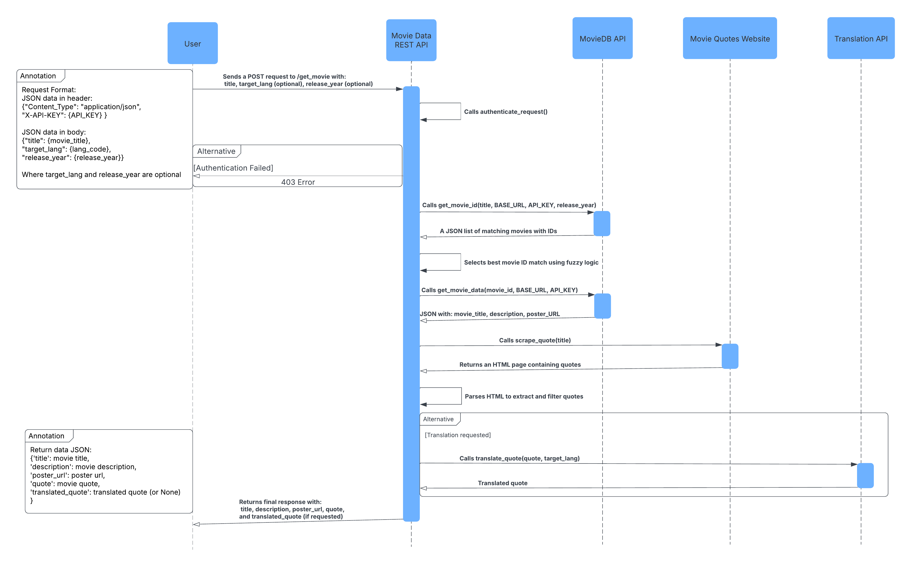

# **Movie Data REST API**  

This microservice provides movie information, movie quotes, and optional translations. The API retrieves movie details from The Movie Database (TMDb), scrapes movie quotes from MovieQuotes.com, and optionally translates quotes into a specified language using DEEPL.  

## **API Overview**  
- **Base URL:** `http://147.93.41.153:5000`  
- **Authentication:** Requires an API key in the request header.  
- **Request Format:** JSON  
- **Response Format:** JSON  

---

## **Authentication**  
To access the API, every request must include an **API Key** in the request headers:  

```json
{
  "Content-Type": "application/json",
  "X-API-KEY": "your_api_key_here"
}
```

---

## **How to Programmatically Request Data**  
### **Endpoint: `/get_movie`**  
Retrieves movie details, a quote, and an optional translated quote.  

### **Method:** `POST`  
### **Request Body:**  
Send a JSON object containing:  
- `"title"` *(string, required)* – The name of the movie.  
- `"target_lang"` *(string, optional)* – The language code for translation (e.g., `"es"` for Spanish).  
- `"release_year"` *(integer, optional)* – The movie's release year (improves search accuracy).  

#### **Example Request (Python)**  

```python
import requests

url = "http://147.93.41.153:5000/get_movie"
headers = {
    "Content-Type": "application/json",
    "X-API-KEY": "your_api_key_here"
}
data = {
    "title": "Inception",
    "target_lang": "fr",
    "release_year": 2010
}

response = requests.post(url, json=data, headers=headers)
```

---

## **How to Programmatically Receive Data**  
If the request is successful, the API responds with a JSON object containing:  
- `"title"` *(string)* – The movie title.  
- `"description"` *(string)* – The movie's synopsis.  
- `"poster_url"` *(string)* – A URL to the movie poster.  
- `"quote"` *(string)* – A randomly selected quote from the movie.  
- `"translated_quote"` *(string or None)* – The translated quote (if translation was requested and target_lang is not 'en').  

### **Example Response**
```python
response = requests.post(url, json=data, headers=headers)
response = response.json()
title = response.get('title')
description = response.get('description')
poster_url = response.get('poster_url')
quote = response.get('quote')
translated_quote = response.get('translated_quote')
```

```json
{
  "title": "Inception",
  "description": "Cobb, a skilled thief who commits corporate espionage by infiltrating the subconscious of his targets is offered a chance to regain his old life as payment for a task considered to be impossible: "inception", the implantation of another person's idea into a target's subconscious."
  "poster_url": "https://image.tmdb.org/t/p/w500/someposter.jpg",
  "quote": "“Don't you want to take a leap of faith ? Or become an old man, filled with regret, waiting to die alone!”",
  "translated_quote": '"Tu ne veux pas faire un saut dans la foi ? Ou devenir un vieil homme, rempli de regrets, attendant de mourir seul !"'
}
```

---

## **Error Handling**  
The API provides error responses in the following scenarios:  

| HTTP Status | Reason |
|-------------|--------|
| `400 Bad Request` | Missing or invalid request parameters. |
| `403 Forbidden` | Authentication failed (invalid API key). |

### **Example Error Response**  

```json
{
  "error": "Invalid API Key"
}
```

---
## **UML Diagram**

## **Important Notes**
- **Ensure that your API key is valid** before making requests.  
- **Movie searches are case-insensitive**, providing a `release_year` improves accuracy.  
- **Quote availability depends on external sources**, and some movies may not have quotes.  
- **Translation is optional** and only occurs if `target_lang` is specified in the request and not set to 'en'.  

---

